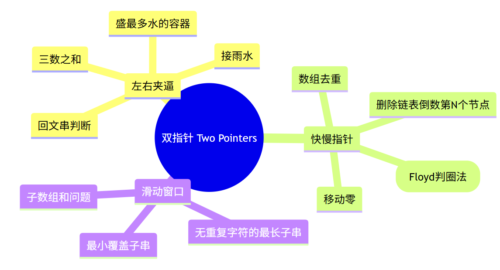

# 双指针学习笔记

## 一、什么是双指针？

双指针（Two Pointers）是一种常见的数组/链表处理技巧，主要思想是**用两个变量同时操作数据结构**，通常通过改变左右指针来优化遍历，减少时间复杂度。

常见场景：

* **左右夹逼**：一头一尾向中间移动（例：三数之和、接雨水）
* **快慢指针**：一个指针遍历，一个指针记录或延迟（例：移动零）
* **窗口滑动**：左右指针控制区间（例：子数组和、无重复子串）



---

## 二、三数之和 —— 排序 + 左右夹逼

**题目核心**：在排序数组中，枚举一个数，再用两个指针在后面找另外两个数，使三数之和为 0。

**思路**：

1. 先排序。
2. 外层循环固定 `i`，跳过重复元素。
3. 设置左右指针 `j=i+1, k=n-1`，计算 `nums[i] + nums[j] + nums[k]`。

   * 若和太大，右指针左移；
   * 若和太小，左指针右移；
   * 若刚好为 0，保存解并跳过重复值。
4. 时间复杂度：O(n²)。

**关键点**：

* 排序去重；
* `while (j < k)`，防止越界；
* 每次找到解后要移动指针，避免重复。

👉 应用类型：**有序数组中的目标和问题**。

---

## 三、接雨水 —— 左右夹逼 + 辅助变量

**题目核心**：某一位置能接多少水，取决于它左右两边的最高值。

**思路**：

1. 用两个指针 `left, right` 分别从两边向中间移动；
2. 维护 `leftMax, rightMax`，记录左右最高柱子；
3. 每次移动较矮的那一边，因为水量由短板决定：

   * 如果 `height[left] < height[right]`，能接的水量是 `leftMax - height[left]`，然后 `left++`；
   * 否则处理右边。
4. 时间复杂度：O(n)，空间 O(1)。

**关键点**：

* **短板效应**：移动较矮的一边；
* `leftMax`、`rightMax` 及时更新；
* 核心公式：

  $$
  water[i] = \min(leftMax, rightMax) - height[i]
  $$

👉 应用类型：**区间两边影响中间值**的问题。

---

## 四、移动零 —— 快慢指针

**题目核心**：将非零元素往前移，零自然被“挤到后面”。

**思路**：

1. 两个指针 `left, right`：

   * `right` 遍历整个数组；
   * `left` 指向下一个应该放非零的位置。
2. 如果 `nums[right] != 0`，就交换 `nums[left]` 和 `nums[right]`，并移动 `left++`。
3. 遍历结束后，所有非零元素都按顺序在前，零在后。

**关键点**：

* 保证非零元素相对顺序；
* 原地交换，不开新数组。

👉 应用类型：**原地修改数组，保持顺序**。

---

## 五、双指针常见模式总结

1. **左右夹逼**

   * 排序数组里找和（两数之和、三数之和、四数之和）
   * 接雨水问题
   * 判断回文串、盛水容器问题

2. **快慢指针**

   * 移动零
   * 删除链表倒数第 N 个节点
   * 环形链表判定（Floyd 判圈法）

3. **滑动窗口**

   * 无重复字符的最长子串
   * 最小覆盖子串
   * 子数组和问题

---

## 六、模板总结

### 1. 左右夹逼模板

```cpp
int i=0, j=n-1;
while(i < j){
    if(nums[i] + nums[j] == target){
        // 找到解
        i++; j--;
    }else if(nums[i] + nums[j] < target){
        i++;
    }else{
        j--;
    }
}
```

### 2. 快慢指针模板

```cpp
int slow = 0;
for(int fast=0; fast<n; fast++){
    if(nums[fast] != 0){
        swap(nums[slow], nums[fast]);
        slow++;
    }
}
```

### 3. 滑动窗口模板

```cpp
int left=0, right=0;
while(right < n){
    // 扩展窗口
    right++;

    // 收缩窗口
    while(不满足条件){
        left++;
    }
}
```

---


