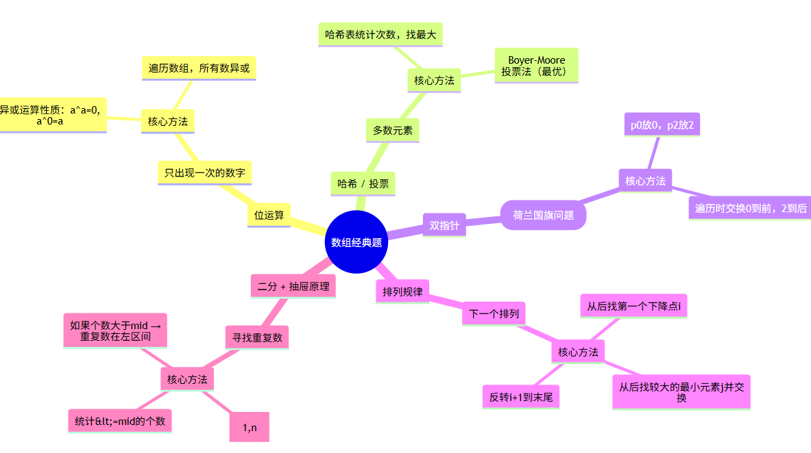

# 📝 经典算法题

---

## 1. 只出现一次的数字（Single Number）

**题目**：数组中除了一个数只出现一次，其他都出现两次，找出该数。要求：

* 时间复杂度 O(n)
* 空间复杂度 O(1)

**思路**：

* 利用异或运算的性质：

  * `a ^ a = 0`
  * `a ^ 0 = a`
  * 异或运算满足交换律和结合律
* 遍历数组，所有数字异或一遍，结果就是唯一的那个数。

**关键代码**：

```cpp
int ret = 0;
for (auto e : nums) ret ^= e;
return ret;
```

**复杂度**：

* 时间：O(n)
* 空间：O(1)

---

## 2. 多数元素（Majority Element）

**题目**：返回数组中出现次数大于 ⌊n/2⌋ 的元素。假设一定存在。

**思路**：

* 方法一：哈希表统计次数 → 找到最大值。
* 方法二（更优）：Boyer-Moore 投票算法（O(n)，O(1)空间）。

你实现的是哈希表版。

**关键代码**：

```cpp
unordered_map<int,int> cnts;
int ma = 0, cnt = 0;
for (int num : nums) {
    ++cnts[num];
    if (cnts[num] > cnt) {
        ma = num;
        cnt = cnts[num];
    }
}
return ma;
```

**复杂度**：

* 时间：O(n)
* 空间：O(n)

---

## 3. 颜色分类（Sort Colors / 荷兰国旗问题）

**题目**：对数组中的 0、1、2 就地排序，顺序是 0 → 1 → 2。不能用 sort()。

**思路**：

* 双指针法：

  * `p0` 指向 0 的放置位置，`p2` 指向 2 的放置位置。
  * 遍历时遇到 0 放前面，遇到 2 放后面，1 留在中间。

**关键代码**：

```cpp
int p0 = 0, p2 = n - 1;
for (int i = 0; i <= p2; ++i) {
    while (i <= p2 && nums[i] == 2) swap(nums[i], nums[p2--]);
    if (nums[i] == 0) swap(nums[i], nums[p0++]);
}
```

**复杂度**：

* 时间：O(n)
* 空间：O(1)

---

## 4. 下一个排列（Next Permutation）

**题目**：给定数组，找出字典序的下一个排列。如果不存在，则重排为最小排列。

**思路**：

1. 从后往前找第一个下降点 `i`（`nums[i] < nums[i+1]`）。
2. 再从后往前找第一个比 `nums[i]` 大的数 `j`，交换两者。
3. 反转 `i+1` 到末尾的序列，使之成为最小排列。

**关键代码**：

```cpp
int i = nums.size() - 2;
while (i >= 0 && nums[i] >= nums[i+1]) i--;
if (i >= 0) {
    int j = nums.size() - 1;
    while (j >= 0 && nums[i] >= nums[j]) j--;
    swap(nums[i], nums[j]);
}
reverse(nums.begin() + i + 1, nums.end());
```

**复杂度**：

* 时间：O(n)
* 空间：O(1)

---

## 5. 寻找重复数（Find the Duplicate Number）

**题目**：数组包含 `n+1` 个数，范围在 \[1, n]，至少有一个数重复。要求：

* 不修改数组
* O(1) 额外空间
* O(n log n) 时间或更优

**思路**：

* 二分查找 + 抽屉原理：

  * 统计 `≤ mid` 的数的个数，如果个数大于 mid，说明重复数在 \[l, mid]；否则在 \[mid+1, r]。
* 最终锁定答案。

**关键代码**：

```cpp
int l = 1, r = n - 1, ans = -1;
while (l <= r) {
    int mid = (l + r) >> 1;
    int cnt = 0;
    for (int i = 0; i < n; ++i) cnt += nums[i] <= mid;
    if (cnt <= mid) l = mid + 1;
    else {
        r = mid - 1;
        ans = mid;
    }
}
return ans;
```

**复杂度**：

* 时间：O(n log n)
* 空间：O(1)

---

# 📌 总结

* **位运算技巧**：题1（异或找唯一）。
* **哈希表 & 投票算法**：题2（多数元素）。
* **双指针（荷兰国旗问题）**：题3。
* **排列生成（数学规律 + 双指针反转）**：题4。
* **二分 + 抽屉原理**：题5。



