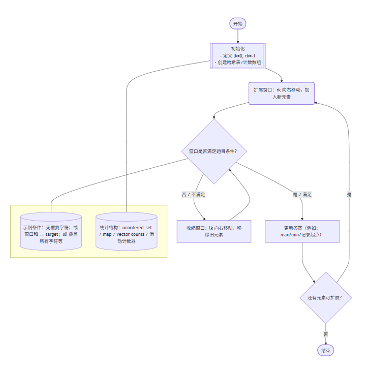

# 📝 滑动窗口学习笔记

## 一、什么是滑动窗口？

滑动窗口（Sliding Window）是一种高效解决 **子串/子数组问题** 的技巧。
它的核心思想是：

* 用两个指针（通常是 **左指针 `lk` 和右指针 `rk`**）标记一个窗口。
* 窗口在遍历过程中不断 **移动/扩展/收缩**。
* 在窗口中维护一些统计信息（如字符频次、元素个数等）。

> 简单来说：**“固定或可变区间 + 快速维护区间状态”**。

---

## 二、滑动窗口的应用场景

典型问题特征：

1. **字符串 / 数组**
2. **子串 / 子数组**（连续的区间）
3. 涉及统计，如：

   * 不重复字符
   * 固定长度的异位词
   * 和为 target 的区间
   * 最大/最小窗口满足某个条件

---

## 三、滑动窗口的一般步骤

1. **初始化**：定义窗口左右指针、哈希表/数组来存储窗口内信息。
2. **扩展窗口**：右指针向右移动，加入新元素。
3. **收缩窗口**（如果不满足条件）：左指针右移，移除旧元素。
4. **更新答案**：在每一步判断当前窗口是否符合题意，更新最优解。



---

## 四、例题解析

### 例题1：最长无重复子串

> 输入: `"abcabcbb"` → 输出: `3`

**思路**

* 窗口 `[lk, rk]` 维护一个不含重复字符的子串。
* 当 `s[rk]` 已经在窗口中时，移动左指针直到去掉重复字符。
* 每次更新最大窗口长度。

**代码**

```cpp
class Solution {
public:
    int lengthOfLongestSubstring(string s) {
        unordered_set<char> occ;
        int n=s.size();
        int rk=-1,ans=0;
        for(int lk=0;lk<n;++lk){
            if(lk!=0){
                occ.erase(s[lk-1]);  //左指针开始移动，要把前一个从集合里除去
            }
            while(rk+1<n&&!occ.count(s[rk+1])) {
                occ.insert(s[rk+1]);
                ++rk;
            }
            ans=max(ans,rk-lk+1);  //更新ans，要么不变要么选择当前lk到rk的位置
        }
        return ans;
    }
};
```

👉 这里的窗口是 **动态变化的区间**，随时保证无重复。

---

### 例题2：找到所有异位词

> 输入: `s = "cbaebabacd", p = "abc"` → 输出: `[0,6]`

**思路**

* 窗口长度固定为 `p.size()`。
* 使用 **频次统计数组** 记录 `s` 的当前窗口与 `p` 的差异。
* 当差异值 `differ == 0` 时，说明是异位词。
* 窗口右移时，更新频次差异。

**代码**

```cpp
class Solution {
public:
    vector<int> findAnagrams(string s, string p) {
        //给p排序，在s里找p对应的排序，输出指针指的下标————万一p很长时效率就很低
        //换题解的优化窗口方法
        int sl=s.size(),pl=p.size();
        //pl>sl时肯定不存在异位词
        if(sl<pl){
            return vector<int>();
        }

        vector<int> ans;
        vector<int> count(26);
        //计算p当中每个字符在p和s里出现的个数
        for(int i=0;i<pl;++i){
            ++count[s[i]-'a'];  //第i个字符出现，就加1
            --count[p[i]-'a'];  //第i个字符出现，-1——>当count==0时说明s中有p的异位词
        }
        int differ=0;
        for(int j=0;j<26;++j){
            if(count[j]!=0){
                ++differ;     //所有的count[j]==0，说明整个窗口都是p的异位词
            }
        }
        if(differ==0){
            ans.emplace_back(0);  //differ统计的就是窗口count里面有多少个字符出现次数与p不一样
        }                           //differ==0了整个窗口都是异位词
        
        //找下标
        for(int i=0;i<sl-pl;++i){
            //移除窗口左端的字母
            if(count[s[i]-'a']==1){
                --differ;
            }
            else if(count[s[i]-'a']==0){
                ++differ;
            }
            --count[s[i]-'a'];
            //移除窗口右端的字母
            if(count[s[i+pl]-'a']==-1){
                --differ;
            }
            else if(count[s[i+pl]-'a']==0){
                ++differ;
            }
            ++count[s[i+pl]-'a'];
            //判断异位词
            if(differ==0){
                ans.emplace_back(i+1);
            }
        }
        return ans;
    }
};
```

👉 这里的窗口是 **固定大小的区间**，不断平移判断。

---

## 五、总结技巧

| 场景             | 窗口大小 | 关键技巧          |
| -------------- | ---- | ------------- |
| 无重复子串          | 可变   | 集合 / 哈希表，动态维护 |
| 异位词匹配          | 固定   | 字符频次数组，差分统计   |
| 最小覆盖子串         | 可变   | 频次计数 + 收缩窗口   |
| 和为 target 的子数组 | 可变   | 前缀和 / 双指针     |

---

## 六、常见套路总结

1. **右指针负责扩展窗口**

   * 不断把新元素加进来。
2. **左指针负责收缩窗口**

   * 当窗口不合法时，移动左指针直到合法。
3. **更新答案的位置**

   * 最大长度问题：更新在扩展时。
   * 最小长度问题：更新在收缩时。
   * 固定长度问题：每次移动时更新。

---

✅ **一句话总结**：
滑动窗口 = **双指针 + 区间统计 + 动态维护**。
学会区分 **固定窗口** 和 **可变窗口**，掌握 “扩展 + 收缩” 的节奏。


